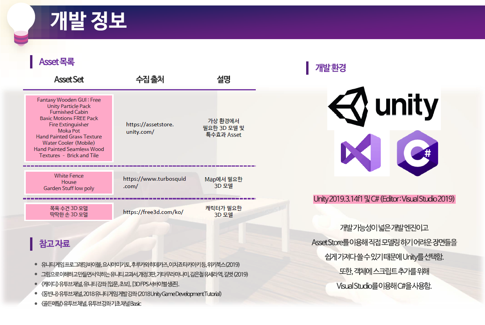

# < 가상현실 프로젝트 >

### Unity를 활용한 재난 상황 시뮬레이션 'Silver Escape'
> 플레이 영상 : https://youtu.be/7ur9MSjIOV4

 

 

## 팀원

|이름|기여|
|---|---|
|[강전호](https://github.com/jeonbar2)|💥 Effect, 💡 Interaction|
|[신현욱](https://github.com/woogie-s)|🙍‍♂️ Character, 🏃 Animation|
|[이수진](https://github.com/suzzini)|📄 UI Design, 🎥 Scene|
|[한재원](https://github.com/hanjo8813)|💒 Map, 💡 Interaction|

 

## 프로젝트 소개
1. Silver Escape는 재난 상황을 가상현실로 미리 체험해 볼 수 있는 Unity 어플리케이션입니다.
2. 사용자는 가상현실에서 재난 상황을 체험해보고 대처 방법을 학습할 수 있습니다.
3. 

 

## 플레이 화면

1) 캐릭터이동

2) 화재상황

3) 결과화면

 

## 실행 방법
> 직접 실행해보고 싶다면?
1. 우선 [SilverEscape.zip](./SilverEscape.zip) 파일을 다운로드합니다. 
2. 위의 링크로 가서 우측의 `Download` 버튼을 누릅니다.
3. 다운로드 후 압축을 풀고 `MyTest.exe` 파일을 실행합니다.

 

## 개발 정보 및 참고
> 현재 Git Hub에 업로드된 파일은 Assets를 최소화하고 소스코드를 남겨둔 파일입니다.

